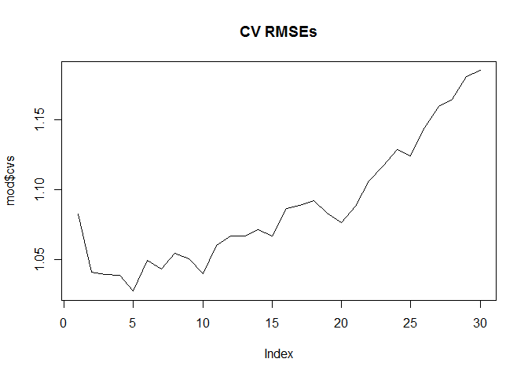

<!-- README.md is generated from README.Rmd. Please edit that file -->
cdifdif
=======

The goal of cdifdif is to ...

Example
-------

This is a basic example which shows you how to solve a common problem:

``` r
library(cdifdif)

data("spilloverDGP")

str(spilloverDGP)
#> Classes 'tbl_df', 'tbl' and 'data.frame':    1000 obs. of  8 variables:
#>  $ id   : int  1 1 2 2 3 3 4 4 5 5 ...
#>  $ dist : num  0 0.25 0 0.5 0 0.75 0 1 0 1.25 ...
#>  $ x    : num  0.774 0.774 0.892 0.892 0.797 ...
#>  $ time : int  0 1 0 1 0 1 0 1 0 1 ...
#>  $ treat: int  0 0 0 0 0 0 0 0 0 0 ...
#>  $ y1   : num  3.92 10.44 3.3 9.38 5.92 ...
#>  $ y2   : num  3.1 8.88 4.38 8.82 2.57 ...
#>  $ y3   : num  13.3 14.7 14.7 14.4 14.3 ...

mod <- cdifdif(y1 ~ time + treat, data = spilloverDGP, dist = spilloverDGP$dist,
               maxDist = 30, delta = 1, alpha = 0.05, k = 10, verbose = FALSE)
```

We can obtain all the CV-RMSE and plot them.

``` r
plot(mod$cvs, type = "l", main = "CV RMSEs")
```



And get the model where we obtain that error:

``` r
nmod <- which.min(mod$cvs)
nmod
#> [1] 5

mod$cvs[[nmod]]
#> [1] 1.025349
```

And then the model:

``` r
mod$mods[[nmod]]$summaries[[nmod]]
#>          term   estimate  std.error statistic      p.value
#> 1 (Intercept)  3.5224125 0.04570940 77.061012 0.000000e+00
#> 2          t1  0.9086385 0.07464314 12.173102 7.143690e-32
#> 3          t2 10.0449985 0.11802116 85.111844 0.000000e+00
#> 4          d1  5.1403294 0.23604232 21.777152 3.014455e-86
#> 5          d2  3.8497968 0.23604232 16.309774 3.681743e-53
#> 6          d3  2.9614936 0.23604232 12.546452 1.276843e-33
#> 7          d4  2.1429545 0.23604232  9.078688 5.793737e-19
#> 8          d5  0.8046168 0.23604232  3.408782 6.787871e-04
```
